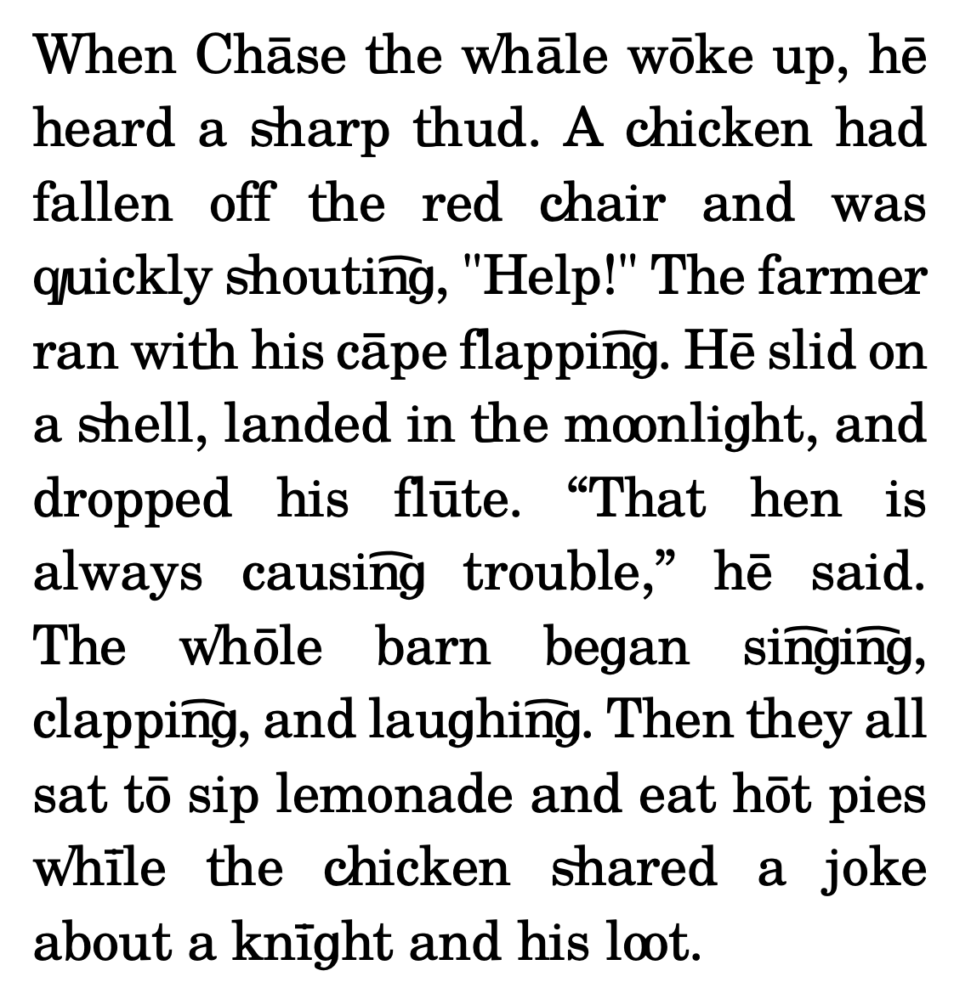

# Reading-Guide Font

- Alpha Release 0.2

**A modern instructional typeface for early readers.**

Reading-Guide is a custom font designed to support early literacy, drawing inspiration from the [Initial Teaching Alphabet](https://en.wikipedia.org/wiki/Initial_Teaching_Alphabet) (ITA) and the [Direct Instruction](https://en.wikipedia.org/wiki/Direct_instruction) (DISTAR) method by Siegfried Engelmann. It aims to improve letter-sound correspondence without the long-term drawbacks associated with prior phonics-first typefaces.

---

## ✨ Key Features

- **Phonics-aligned ligatures**  
  Automatically merges common phonemes (e.g., "sh", "th", "wh") into single glyphs to reinforce sound units visually.

- **Smooth transition to standard orthography**  
  Unlike ITA, Reading-Guide maintains close resemblance to standard English letterforms to avoid re-learning.

- **Multiple weights**  
  Will include **Bold**, **Regular** **Century Schoolbook** variants to accommodate various reading levels and print media.

- **Flexible usage**  
  Designed for web, screen and print, this font is ideal for educators, caregivers, and curriculum developers.

---

## 🧠 Motivation

### 🔎 ITA – Limitations Addressed

The Initial Teaching Alphabet was revolutionary but had flaws:

- ❌ *Too different from the standard alphabet* — led to **misspellings and confusion** when transitioning to regular text.
- ❌ *Assumed a 1:1 sound-to-letter mapping* — failed to teach the complexity of English spelling (e.g., *knight* vs. *night*, *lute* vs. *loot*).

### 📚 DISTAR – Lessons Learned

While the **DISTAR** method promoted direct instruction:

- ❌ The font used in *Teach Your Child to Read in 100 Easy Lessons* was **bold, oversized**, and **not visually aligned** with traditional fonts.
- ❌ Content is limited to those contained within lessons, and does not allow for reading other reading materials utilizing the method.

---

## 🛠️ Design Principles

- **Transitional**  
  Phases out over time as children become fluent — not meant to replace the standard alphabet permanently.
  
- **Legible and Elegant**  
  Carefully constructed glyphs support visual discrimination without sacrificing aesthetics.

- **Contextual Ligatures**  
  Dynamically reinforces digraphs and blends through OpenType features. 
  Based on TeX-Gyre-Schola (refer to the GUST Font License).
  Allows young readers to consume content across different forms of media.

---
## 📄 Type Specimen

## 📄 Sample and Usage

### 📄 Webfonts
Webfonts are available within woff2 and woff formats, refer to [webfont usage](web-fonts/usage.md) for instructions on use.

A [Live example of webfonts](https://dmboyd.github.io/Reading-Guide/) is available which demonstrates the fallback to base css, and provides an example implementation of utilizing subscript to represent silent letters.

### 📄 Print Fonts
A sample storybook using the Reading-Guide font is available:

📘 [The Tale of Peter Rabbit – Beatrix Potter](Sample/Peter_Rabbit.pdf) (Public Domain)
This beloved classic has been re-typeset using the Reading-Guide font to showcase its effectiveness in natural reading contexts.

## 🚧 TODO

- [ ] Finalize glyph set for all phonemes and font weights
- [x] Publish as a webfont with CSS fallback
- [ ] Release workflow for prosody / phoneme mapping to graphemes
- [ ] Address phonemic variants by local accent
- [ ] Develop teacher resource kit

## 📄 License

The font is licensed  under the TeX-Gyre-Schola (refer to the GUST Font License)

## 🌟 Stay Updated

If you believe in the mission of early literacy and better phonics design:

⭐ Star this project to follow its development and help spread the word!
